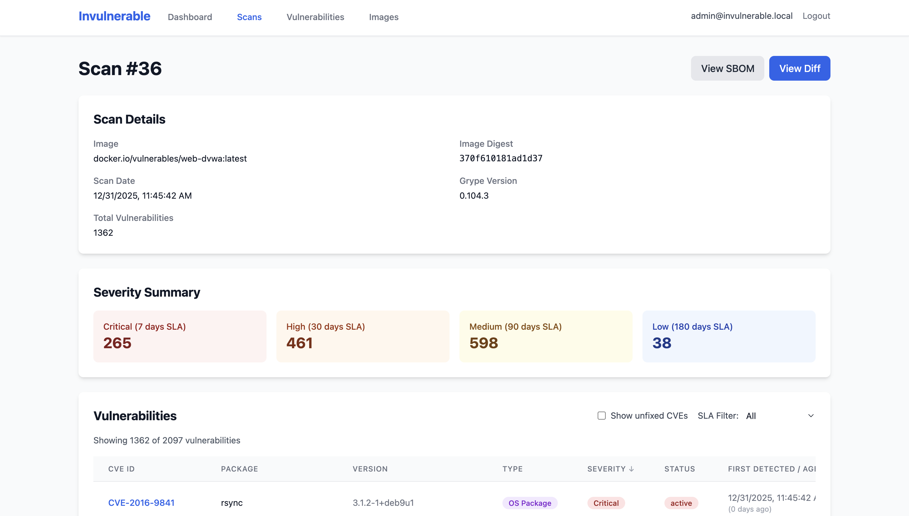

# Invulnerable

> Cloud-native container vulnerability management platform powered by Anchore

[](https://opensource.org/licenses/MIT)
[](https://kubernetes.io/)
[](https://go.dev/)
[](https://helm.sh/)

Invulnerable is a Kubernetes-native vulnerability management platform that provides automated container image scanning, SBOM generation, and vulnerability lifecycle tracking. Built on top of Anchore's industry-standard tools (Syft and Grype), it offers a modern web interface and comprehensive API for managing security at scale.



## ✨ Key Features

- 🔍 **Automated SBOM Generation** - Uses Syft to create detailed Software Bill of Materials in CycloneDX/SPDX formats
- 🛡️ **Vulnerability Scanning** - Powered by Grype for comprehensive CVE detection across multiple ecosystems
- 📊 **Vulnerability Lifecycle Tracking** - Monitor vulnerabilities from discovery to resolution
- 🔄 **Scan Comparison & Diff** - Track changes between scans to identify new and fixed vulnerabilities
- 📈 **Metrics & Dashboards** - Real-time insights into your security posture
- 🎯 **Kubernetes-Native** - CRD-based controller for declarative image scanning
- 🔐 **OAuth2 Authentication** - Support for Google, GitHub, Keycloak, Azure AD, and more
- 🚀 **Production-Ready** - Helm charts, HPA, and non-root containers

## 📑 Table of Contents

- [Architecture](#architecture)
- [Quick Start](#quick-start)
- [Installation](#installation)
- [Usage](#usage)
- [Configuration](#configuration)
- [Documentation](#documentation)
- [Development](#development)
- [Contributing](#contributing)
- [License](#license)
- [Acknowledgments](#acknowledgments)

## 🏗️ Architecture

```
┌─────────────────────────────────────────────────────────┐
│                    Invulnerable Platform                 │
├──────────────┬──────────────────┬───────────────────────┤
│   Frontend   │     Backend      │      Controller       │
│  (React +    │   (Go + Echo)    │  (Kubernetes CRD)     │
│  Vite)       │                  │                       │
└──────┬───────┴────────┬─────────┴──────────┬────────────┘
       │                │                    │
       │                ├────────────────────┤
       │                │   PostgreSQL       │
       │                │   (SBOM + Data)    │
       │                └────────────────────┘
       │                          │
       └──────────────────────────┼───────────────────┐
                                  │                   │
                          ┌───────▼────────┐  ┌───────▼────────┐
                          │  ImageScan CRD │  │  ImageScan CRD │
                          │  (nginx:latest)│  │  (app:v1.0.0)  │
                          └───────┬────────┘  └───────┬────────┘
                                  │                   │
                          ┌───────▼────────┐  ┌───────▼────────┐
                          │  Scanner Job   │  │  Scanner Job   │
                          │  (Syft+Grype)  │  │  (Syft+Grype)  │
                          └────────────────┘  └────────────────┘
```

**Tech Stack:**
- **Backend**: Go 1.21+ with Echo framework, sqlx, PostgreSQL
- **Frontend**: React 18 with Vite, TypeScript, TailwindCSS
- **Controller**: Kubernetes controller-runtime, kubebuilder patterns
- **Scanning**: Anchore Syft (SBOM) + Grype (vulnerabilities)
- **Auth**: OAuth2-Proxy with multi-provider support
- **Database**: PostgreSQL 15+ with JSONB for SBOM storage

## 🚀 Quick Start

### Prerequisites

- Kubernetes 1.19+ cluster
- Helm 3.0+
- kubectl configured

### Installation with Helm

```bash
# Add Helm repository (if published)
# helm repo add invulnerable https://pacokleitz.github.io/invulnerable

# Install with default values
helm install invulnerable ./helm/invulnerable \
  --namespace invulnerable \
  --create-namespace

# Access the application
kubectl port-forward -n invulnerable svc/invulnerable-frontend 8080:80

# Visit http://localhost:8080
```

### Create Your First Image Scan

```bash
# Define images to scan using Kubernetes CRDs
kubectl apply -f - <<EOF
apiVersion: invulnerable.io/v1alpha1
kind: ImageScan
metadata:
  name: nginx-scan
  namespace: invulnerable
spec:
  image: "nginx:latest"
  schedule: "0 */6 * * *"  # Every 6 hours
EOF

# Check scan status
kubectl get imagescans -n invulnerable
kubectl describe imagescan nginx-scan -n invulnerable
```

## 📦 Installation

### Using Helm (Recommended)

See the complete [Deployment Guide](docs/DEPLOYMENT.md) for production installations.

**Quick production setup with authentication:**

```bash
# 1. Create values file
cat > production-values.yaml <<EOF
image:
  registry: "ghcr.io/yourusername"

backend:
  database:
    host: "postgres.production.svc.cluster.local"
    existingSecret: "postgres-credentials"

  autoscaling:
    enabled: true
    minReplicas: 2
    maxReplicas: 10

# IMPORTANT: Enable BOTH ingress and oauth2Proxy for secure public access
oauth2Proxy:
  enabled: true
  clientID: "your-oauth-client-id"
  clientSecret: "your-oauth-client-secret"
  cookieSecret: "generate-with-openssl-rand"
  config:
    provider: "google"  # or github, azure, oidc, etc.
    redirectUrl: "https://invulnerable.example.com/oauth2/callback"
    emailDomains:
      - "yourcompany.com"

ingress:
  enabled: true
  className: "nginx"
  hosts:
    - host: invulnerable.example.com
      paths:
        - path: /api
          backend: backend
        - path: /
          backend: frontend
  tls:
    - secretName: invulnerable-tls
      hosts:
        - invulnerable.example.com
EOF

# 2. Install
helm install invulnerable ./helm/invulnerable \
  -f production-values.yaml \
  --namespace invulnerable \
  --create-namespace
```

### Using Taskfile (Development)

```bash
# Install Task: https://taskfile.dev
brew install go-task/tap/go-task  # macOS

# One-command deploy
task quickstart

# Or step by step
task build:all
task deploy
```

## 🎯 Usage

### Web Interface

Access the dashboard at your ingress hostname or via port-forward:

- **Dashboard**: View metrics, trends, and recent activity
- **Images**: Browse scanned container images
- **Scans**: View scan history and results
- **Vulnerabilities**: Search and filter CVEs, update status
- **Scan Diff**: Compare scans to see what changed

### API Endpoints

**Scans**
```bash
# Submit scan results
curl -X POST http://api/v1/scans -d @scan-results.json

# List scans
curl http://api/v1/scans?limit=20&offset=0

# Get scan details
curl http://api/v1/scans/{id}

# Compare with previous scan
curl http://api/v1/scans/{id}/diff
```

**Vulnerabilities**
```bash
# List vulnerabilities with filters
curl "http://api/v1/vulnerabilities?severity=critical&status=active"

# Get CVE details
curl http://api/v1/vulnerabilities/{cve}

# Update vulnerability status
curl -X PATCH http://api/v1/vulnerabilities/{id} \
  -d '{"status":"accepted","notes":"Risk accepted for legacy system"}'
```

**Metrics**
```bash
# Get dashboard metrics
curl http://api/v1/metrics
```

See [API Documentation](docs/api.md) for complete reference.

### Kubernetes CRDs

Define images to scan declaratively:

```yaml
apiVersion: invulnerable.io/v1alpha1
kind: ImageScan
metadata:
  name: production-api
  namespace: invulnerable
spec:
  # Image to scan
  image: "myregistry.io/api:v2.1.0"

  # Scan schedule (cron format)
  schedule: "0 */6 * * *"  # Every 6 hours

  # SBOM format (cyclonedx or spdx)
  sbomFormat: "cyclonedx"

  # Resource limits for scanner jobs
  resources:
    requests:
      memory: "512Mi"
      cpu: "500m"
    limits:
      memory: "2Gi"
      cpu: "2000m"

  # Suspend scanning (useful for maintenance)
  suspend: false
```

## ⚙️ Configuration

### Authentication

Enable OAuth2 authentication for protecting access:

```yaml
# values.yaml
oauth2Proxy:
  enabled: true
  clientID: "your-client-id"
  clientSecret: "your-client-secret"
  cookieSecret: "generate-with-openssl"

  config:
    provider: "google"  # or github, azure, oidc, etc.
    redirectUrl: "https://invulnerable.example.com/oauth2/callback"
    emailDomains:
      - "yourcompany.com"
```

See [Authentication Guide](docs/AUTHENTICATION.md) for provider-specific setup (Google, GitHub, Keycloak, Azure AD, etc.).

### Registry Configuration

Use private container registries:

```yaml
# Global registry for all components
image:
  registry: "ghcr.io/myorg"

# Or override per component
scanner:
  image:
    registry: "myregistry.azurecr.io"
    repository: "invulnerable-scanner"
```

### Database

External PostgreSQL is required:

```yaml
backend:
  database:
    host: "postgres.example.com"
    port: 5432
    user: "invulnerable"
    name: "invulnerable"
    sslmode: "require"
    existingSecret: "db-credentials"
    passwordKey: "password"
```

See [Helm Chart README](helm/invulnerable/README.md) for all configuration options.

## 📚 Documentation

- **[Deployment Guide](docs/DEPLOYMENT.md)** - Production deployment with Helm
- **[Authentication Setup](docs/AUTHENTICATION.md)** - OAuth2 configuration for all providers
- **[Helm Chart README](helm/invulnerable/README.md)** - Complete chart configuration reference
- **[Controller Documentation](controller/README.md)** - ImageScan CRD usage and RBAC
- **[Controller Security](controller/SECURITY.md)** - Security model and best practices
- **[API Reference](docs/api.md)** - REST API documentation
- **[Taskfile Reference](.taskfile.md)** - Development commands and workflows

## 🛠️ Development

### Local Development Setup

**Prerequisites:**
- Go 1.21+
- Node.js 18+
- PostgreSQL 15+
- Docker
- Task (optional but recommended)

**Run locally:**

```bash
# Start PostgreSQL (or use existing)
docker run -d \
  -e POSTGRES_USER=invulnerable \
  -e POSTGRES_PASSWORD=changeme \
  -e POSTGRES_DB=invulnerable \
  -p 5432:5432 \
  postgres:15

# Run migrations
cd backend
make migrate-up

# Start backend
task dev:backend
# Or: cd backend && go run cmd/server/main.go

# Start frontend (in another terminal)
task dev:frontend
# Or: cd frontend && npm run dev
```

### Testing

```bash
# Run all tests
task test

# Run with coverage
task test:coverage

# Run linter
task lint

# Watch mode
task test:watch
```

**Test Coverage:**
- ✅ Unit tests for models, DB layer, API handlers
- ✅ Integration tests with database mocking
- ✅ Scan diff/analyzer logic tests
- ✅ Test files in `*_test.go`

### Building

```bash
# Build all images
task build:all

# Build specific component
task build:backend
task build:frontend
task build:scanner
task build:controller

# Tag and push to registry
docker tag invulnerable-backend:latest ghcr.io/yourusername/invulnerable-backend:v1.0.0
docker push ghcr.io/yourusername/invulnerable-backend:v1.0.0
```

### Project Structure

```
invulnerable/
├── backend/                 # Go backend application
│   ├── cmd/server/         # Main entry point
│   ├── internal/
│   │   ├── api/           # HTTP handlers
│   │   ├── db/            # Database layer (sqlx)
│   │   ├── models/        # Data models
│   │   ├── analyzer/      # Scan diff logic
│   │   └── metrics/       # Metrics service
│   ├── migrations/        # SQL migrations
│   └── Dockerfile
├── frontend/              # React frontend
│   ├── src/
│   │   ├── components/   # React components
│   │   ├── hooks/        # Custom React hooks
│   │   ├── store/        # State management
│   │   └── lib/          # API client, utilities
│   └── Dockerfile
├── controller/            # Kubernetes controller
│   ├── api/v1alpha1/     # CRD definitions
│   ├── internal/         # Controller logic
│   └── config/           # RBAC, CRD manifests
├── scanner/              # Syft + Grype scanner
│   ├── scan.sh          # Scanning script
│   └── Dockerfile
├── helm/invulnerable/    # Helm chart
│   ├── templates/       # Kubernetes manifests
│   ├── values.yaml      # Default configuration
│   └── examples/        # Example configurations
└── docs/                # Additional documentation
```

## 🤝 Contributing

Contributions are welcome! Here's how you can help:

1. **Fork the repository**
2. **Create a feature branch** (`git checkout -b feature/amazing-feature`)
3. **Make your changes**
4. **Run tests** (`task test`)
5. **Run linter** (`task lint`)
6. **Commit your changes** (`git commit -m 'Add amazing feature'`)
7. **Push to the branch** (`git push origin feature/amazing-feature`)
8. **Open a Pull Request**

### Development Guidelines

- Write tests for new features
- Follow Go and React best practices
- Update documentation for user-facing changes
- Keep commits atomic and well-described
- Ensure all tests pass before submitting PR

### Reporting Issues

Found a bug or have a feature request? Please open an issue on GitHub with:
- Clear description of the problem or feature
- Steps to reproduce (for bugs)
- Expected vs actual behavior
- Environment details (K8s version, Helm version, etc.)

## 🗺️ Roadmap

- [ ] Prometheus metrics exporter
- [ ] Webhook notifications (Slack, Teams, Discord)
- [ ] Policy engine for vulnerability acceptance
- [ ] Multi-cluster support
- [ ] Historical trend analysis
- [ ] SBOM export and sharing
- [ ] Integration with CI/CD pipelines
- [ ] Custom vulnerability data sources

## 📄 License

This project is licensed under the MIT License - see the [LICENSE](LICENSE) file for details.

## 🙏 Acknowledgments

- **[Anchore](https://anchore.com/)** - For the excellent Syft and Grype tools
- **[Syft](https://github.com/anchore/syft)** - SBOM generation
- **[Grype](https://github.com/anchore/grype)** - Vulnerability scanning
- **[controller-runtime](https://github.com/kubernetes-sigs/controller-runtime)** - Kubernetes controller framework
- **[OAuth2 Proxy](https://oauth2-proxy.github.io/oauth2-proxy/)** - Authentication layer

## 💬 Community & Support

- **Issues**: [GitHub Issues](https://github.com/pacokleitz/invulnerable/issues)
- **Discussions**: [GitHub Discussions](https://github.com/pacokleitz/invulnerable/discussions)
- **Email**: kpaco@proton.me

---

Built with ❤️ for the cloud-native security community
